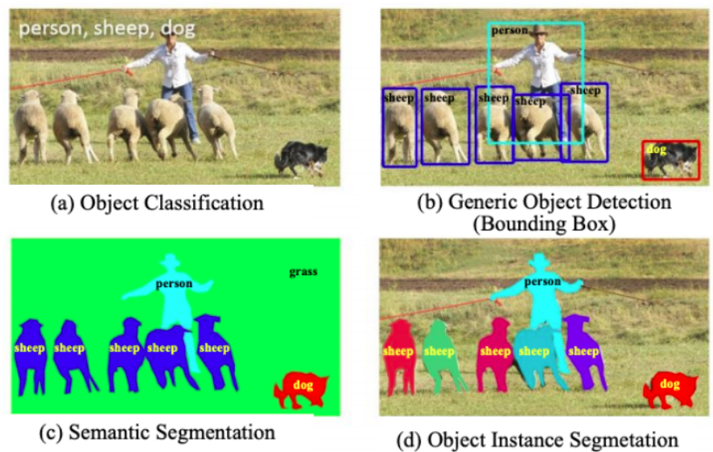

# Object Detection

다음 2가지 작업을 실행

- 물체의 위치를 탐지(localization)
- 물체를 분류(classification)

물체 분류는 제시된 영상에 특정 대상의 유무를 판단하는 작업


물체 탐지는 특정 대상의 위치와 대상을 판단한는 작업


이외에 다른 작업들도 있다.


<br>


# YOLO

<br>


## DarkNet

TensorFlow나 pythoh 기반이 아닌 c/c++로 구현된 Darknet을 기반으로 한다.

- DarkNet 홈 : https://pjreddie.com/darknet/
- YOLO 홈 : https://pjreddie.com/darknet/yolo/
- YOLO 프로젝트 : https://github.com/pjreddie/darknet

다만 미리 학습된 모델의 weight 파일을 제공한다.


- 실습 자료 : [object_detection_yolo_darknet.ipynb](deep_learning/object_detection_yolo_darknet.ipynb)

- 적용 예 : https://drive.google.com/file/d/1ZGiJtRBG8wyI3nn8oI9iKqJC4zOitghT/view?usp=sharing

<br>


## Pythyon Keras 변환

python에서 Keras로 사용하려면 학습된 파일과 모델 설정을 가지고 변환해서 사용한다.

다음 프로젝트가 이런 기능을 제공한다.

https://github.com/qqwweee/keras-yolo3

이 프로젝트를 사용하여 탐지 실행, 학습 등을 할 수 있다.

<br>

- 실습 자료 : [object_detection_yolo_keras.ipynb](deep_learning/object_detection_yolo_keras.ipynb)


# YOLO 커스텀 데이터 학습

keras-yolo3 사용

https://github.com/qqwweee/keras-yolo3


## 데이터 준비

2개의 파일
- 킅래스 파일
- 레이블링 파일과

### 클래스 파일
클래스의 이름이 있는 파일.

1줄에 1개

```
person
bicycle
car
motorbike
aeroplane
bus
train
...
```

### 레이블링 파일
1줄에 1개 파일에 대한 레이블링
```
image_file_path box1 box2 ... boxN
```

box 포멧은 다음과 같다.
```
x_min,y_min,x_max,y_max,class_id
```

다음은 파일 예
```
path/to/img1.jpg 50,100,150,200,0 30,50,200,120,3
path/to/img2.jpg 120,300,250,600,2
```

레이블링을 위한 다음과 같은 툴을 사용할 수 있다.
- https://github.com/Cartucho/OpenLabeling
- https://github.com/tzutalin/labelImg
- https://github.com/AlexeyAB/Yolo_mark

<br>


## 학습 실행

```
python train.py
```

